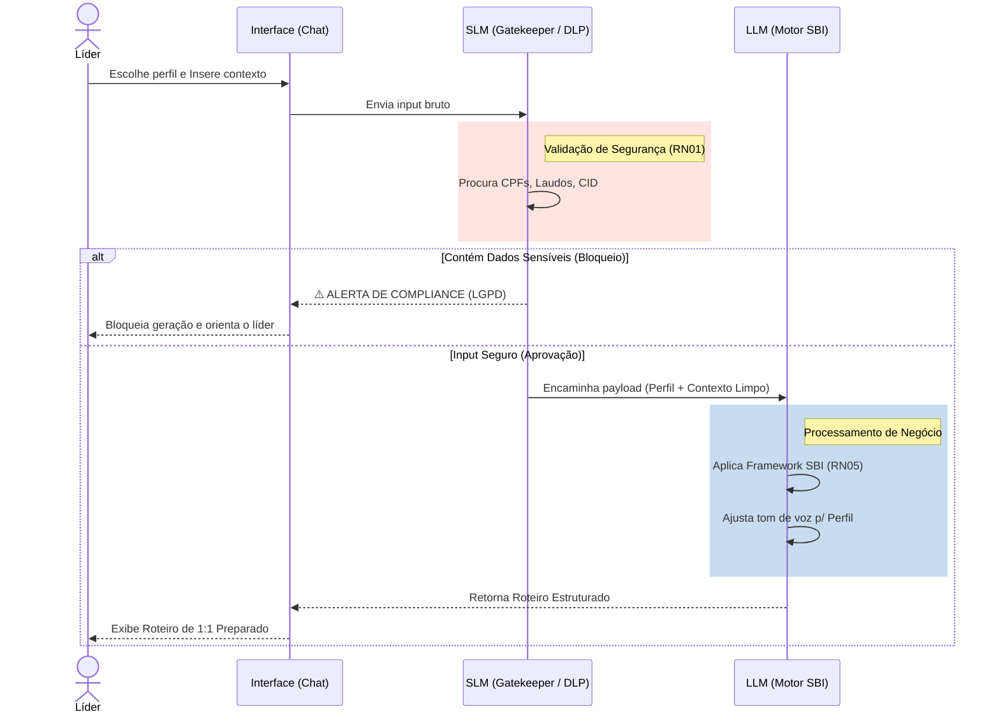

# Contexto Técnico e Prova de Conceito (PoC) - Smart Leading

Este documento consolida as descobertas, testes de prompts e decisões técnicas da Fase de PoC (Sprint 2), servindo como base para a apresentação ao cliente.

## 1. Escopo do MVP Avaliado
O MVP foca exclusivamente na **preparação do líder** para conversas de 1:1 e feedbacks.
- **Dentro da PoC:** Validação de inputs do usuário (barrando dados sensíveis - LGPD), aplicação do System Prompt com base no perfil do líder (Técnico, Transição, Engajado) e formatação da saída no modelo SBI.
- **Fora da PoC:** Dashboards, Integração com sistemas de RH (Sólides), Banco de dados definitivo.

## 2. Tecnologias e Soluções Propostas
Para garantir segurança corporativa e resolver o problema sem criar overhead de engenharia no MVP, a stack proposta adota a arquitetura de **Guardrails (Multi-Modelo)**:
- **Camada 1 - SLM (Small Language Model / Gatekeeper):** [A definir - ex: Llama 3 8B, Gemini Flash ou NLP clássico (Presidio)] - Usado exclusivamente como firewall inicial de DLP (Data Loss Prevention). Sua única função é validar se há dados sensíveis (LGPD) no input com alta velocidade e baixo custo.
- **Camada 2 - LLM Principal (Motor de Raciocínio):** [A definir - ex: Gemini 3.1 Pro / Claude 3.5 Sonnet] - Acionado apenas se a SLM aprovar o input. Responsável por aplicar o framework SBI e adaptar o tom de voz (altamente exigente em raciocínio e *prompt engineering*).
- **Orquestração/Testes:** Google Antigravity (para prototipagem rápida dos prompts, red teaming e fluxos).

## 3. Diagrama de Funcionamento (Apoio Visual)
Abaixo está o fluxo desenhado para tangibilizar a ideia para o cliente.

## 4. Testes de Prompt e Descobertas
*Nesta seção, registraremos as versões dos prompts testados no Antigravity e os resultados obtidos.*

### Teste 1: Bloqueio LGPD (RN01)
- **Objetivo:** Garantir que o agente recuse atestados médicos ou CPFs.
- **Prompt Utilizado:** `[Inserir prompt aqui]`
- **Resultado:** `[Funcionou? Precisou de ajustes?]`

### Teste 2: Geração de Roteiro - Perfil Técnico
- **Objetivo:** Gerar um roteiro objetivo (SBI) em menos de 5 segundos.
- **Prompt Utilizado:** `[Inserir prompt aqui]`
- **Resultado:** `[Avaliação do tom de voz gerado]`

## 5. Próximos Passos e Alinhamento
- [ ] Validar diagramas e fluxo com a liderança.
- [ ] Apresentar exemplos reais de roteiros gerados pela PoC.
- [ ] Confirmar se o tom de voz da IA atende à cultura da ClearIT.
